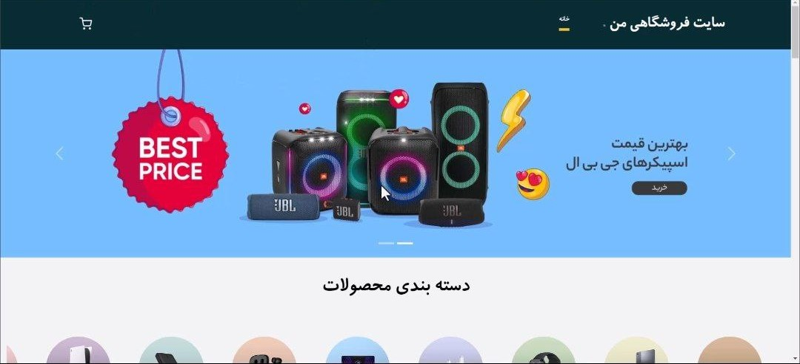
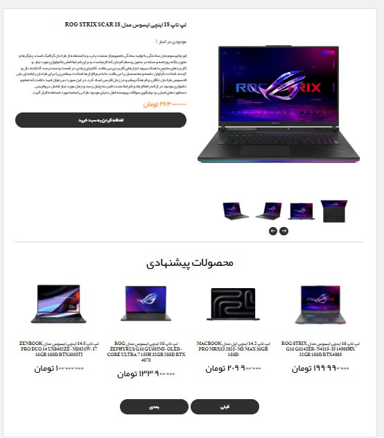
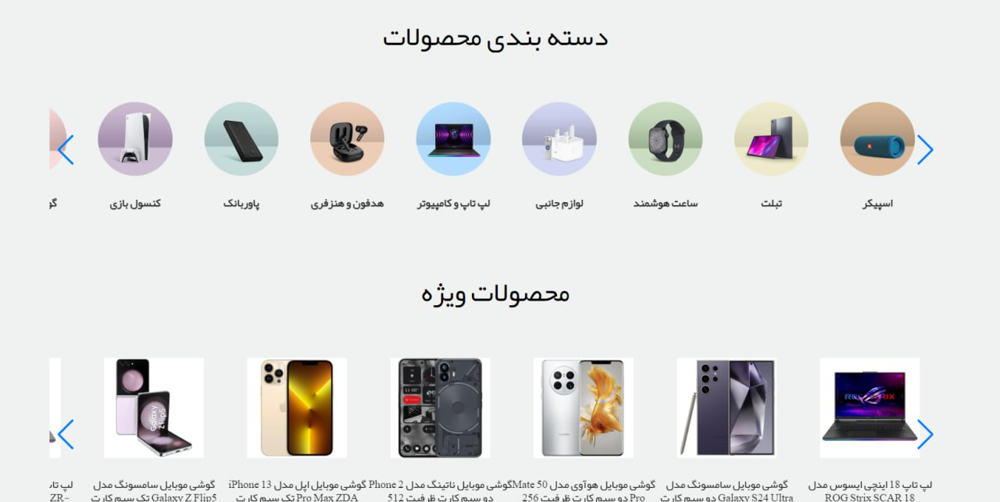
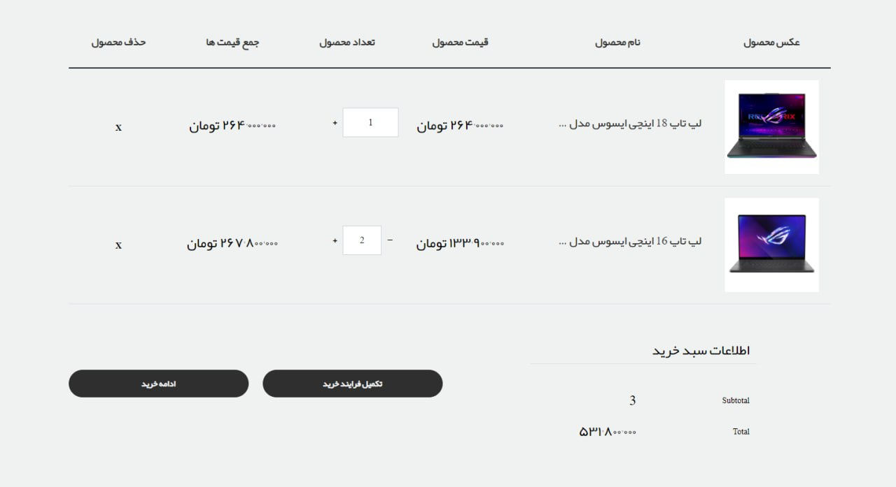

# Shop Project

# Server ( Backend ):
#### with Django

Django has been used in this project to create a secure and strong server.

JWT system is used for authentication.

Creating one-to-many relationships for database tables.

Implementation of functional admin.

Tools used in this project:
-    Django Rest Framework ( DRF )
-    Django Rest Framework Simple JWT
-    , ......
-    

# Client ( Frontend ):
#### with VueJs 

For dynamism and development, View has been used in this project, and many features of View have been used in this project.

Tools used in this project:
-    Pinia
-    Router.
-    Vee Validate.
-    Axios.
-    Tailwind.
-    Vue Transition.
-    Howler for play music.
-    Implementation of pagination.
-    , ......
  

